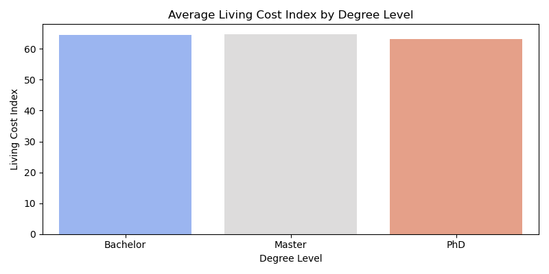
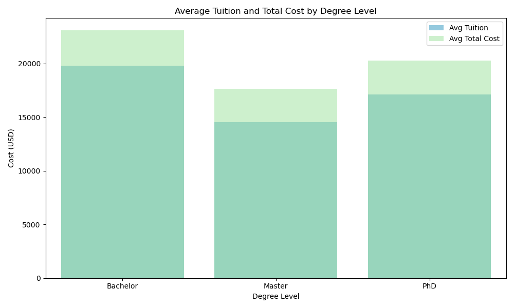
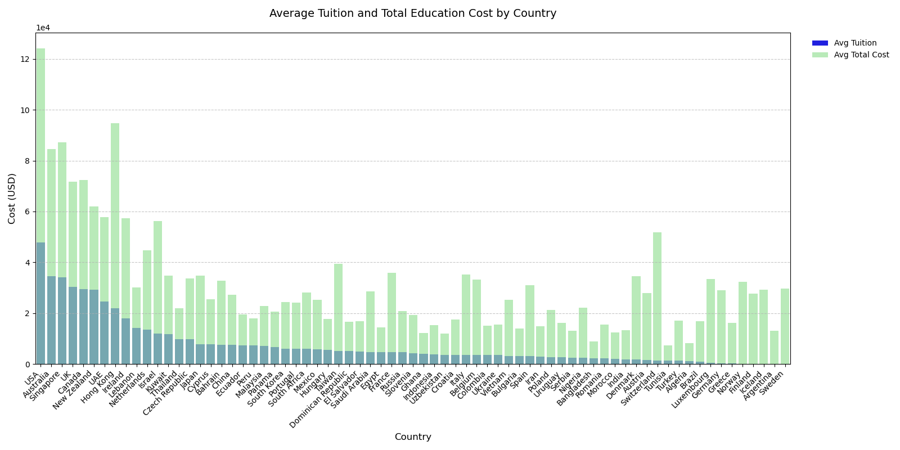
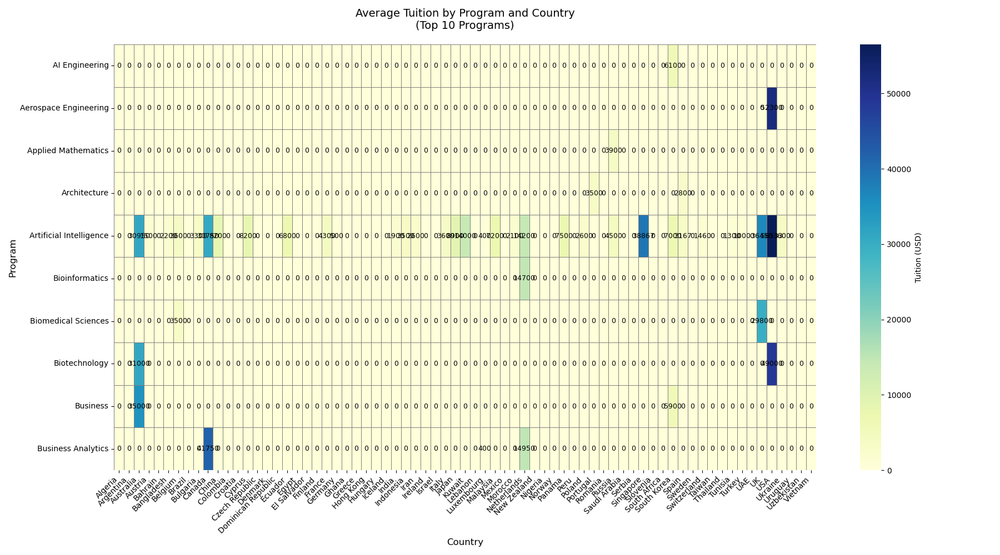

# International Education Cost Analysis / 国际教育成本分析

This analysis delves into the various costs associated with pursuing international education, offering insights that cater to students, educational consultants, and researchers. The dataset, titled "Cost of International Education," is a comprehensive compilation of financial information for students considering higher education abroad. It encompasses multiple countries, cities, and universities, providing a detailed overview of tuition fees, living expenses, and other related costs. By examining this data, we can identify trends, compare costs across different regions and degree levels, and ultimately provide guidance on making financially informed decisions regarding international education.

The dataset includes standardized fields such as tuition fees in USD, living cost indices, rent, visa fees, insurance, and exchange rates. These elements enable a comparative analysis across various programs and geographies. Whether you're a prospective international student mapping out budgets, an educational consultant advising on affordability, or a researcher studying global education economics, this dataset offers a solid foundation for data-driven insights.

本次分析深入探讨了国际教育所涉及的各种成本，为学生、教育顾问和研究人员提供了有针对性的见解。名为“国际教育成本”的数据集全面汇编了计划出国留学的学生的财务信息。它涵盖多个国家、城市和大学，提供了学费、生活费和其他相关成本的详细概览。通过检查这些数据，我们可以识别趋势，比较不同地区和学位等级的成本，并最终就国际教育的财务决策提供指导。

该数据集包括标准化的字段，如以美元计的学费、生活成本指数、租金、签证费用、保险和汇率。这些元素使得能够对不同项目和地区进行比较分析。无论你是计划出国留学的学生在制定预算，教育顾问在提供经济实惠的建议，还是研究人员在研究全球教育经济，此数据集都为数据驱动的洞察提供了坚实的基础

## 🐱Table of Contents / 目录
- [数据清洗 Data Cleaning](#数据清洗-data-cleaning)
- [可视化 Visualizations](#可视化-visualizations)
- [见解与解释  Insights-and-Explanations](#见解与解释-Insights-and-Explanations).
- [建议 Recommendations](#建议-recommendations)
- [结论 Conclusion](#结论-conclusion)

## 🚿数据清洗 Data Cleaning

#### 数据清洗流程如下：
1.	数据上传：
 使用 SCP 将本地 CSV 文件上传至 Hadoop 虚拟机的 HDFS 路径。
 在 Hive View 中创建 international_education_costs 表，指定字段格式、分隔符，并设置 TBLPROPERTIES ("skip.header.line.count"="1") 来跳过表头。
2.	字段校验与类型转换：
 将各字段定义为适当的数据类型，如 DOUBLE（学费、生活费等）、INT（时长）、STRING（国家、城市、大学等）。
 Hive 表建成后，通过查询确认数据成功加载并可以进行 SQL 操作。
3.	缺失值与异常值检查：
 使用 Hive SQL 查看是否存在 NULL 或无效值（如负数学费、生活指数为 0 等）。这次采用的数据源结构良好，未发现明显缺失或错误数据。有一个需要注意的是表格中部分北欧国家的学费为0，但是这不是缺失值，部分北欧国家的学校是免学费的。
4.	逻辑派生字段创建（在分析中完成）：
 在 Python 中读取 Hive 查询结果后，派生字段如 Total_Cost_USD（学费 + 签证费 + 保险 + 房租等）以及国家/学位维度的平均值列，为后续可视化准备数据。

#### Data cleaning process is as follows:
1. Data Upload:
 Use SCP to upload the local CSV file to the HDFS path of the Hadoop virtual machine.
 Create the international_education_costs table in Hive View, specifying the field format, delimiters, and setting TBLPROPERTIES ("skip.header.line.count"="1") to skip the header.
2. Field Validation and Type Conversion:
 Define each field as an appropriate data type, such as DOUBLE (tuition, living expenses, etc.), INT (duration), STRING (country, city, university, etc.).
 After the Hive table is built, confirm that the data is successfully loaded and SQL operations can be performed through queries.
3. Missing Value and Outlier Check:
 Use Hive SQL to check for NULL or invalid values ​​(such as negative tuition fees, living index of 0, etc.). The data source used this time has a good structure, and no obvious missing or incorrect data was found. One thing to note is that the tuition fees of some Nordic countries in the table are 0, but this is not a missing value. Some schools in Nordic countries are tuition-free.
4. Logical Derived Field Creation (completed in analysis):
 After reading the Hive query results in Python, derive fields such as Total_Cost_USD (tuition + visa fee + insurance + rent, etc.) and average value columns for country/degree dimensions to prepare data for subsequent visualization.
## 🤩可视化 visualization
### 🥛各国平均生活成本指数 Average cost of living index of various countries
该图表展示了不同国家的生活成本指数，指数越高表示生活成本越高。瑞士、新加坡和冰岛的生活成本指数最高，而埃及、孟加拉国和越南的生活成本指数最低。这一信息对于计划出国留学的学生来说非常关键，因为它直接影响到他们的日常开销和预算规划。

This chart illustrates the average living cost index across various countries. A higher index indicates a higher cost of living. Switzerland, Singapore, and Iceland top the list with the highest living costs, while Egypt, Bangladesh, and Vietnam have the lowest. This information is crucial for students planning to study abroad as it directly impacts their daily expenses and budget planning.

### 🥛不同学位平均生活成本指数 The average living index of different degrees
该图表显示了不同学位等级的生活成本指数。可以看出，学士、硕士和博士三个学位等级的生活成本指数相对接近。这表明无论学生攻读哪个学位，生活成本的变化幅度相对较小，学校所在地的生活水平是主要影响因素。

This chart shows the average living cost index by degree level. It reveals that the living cost index for Bachelor's, Master's, and PhD levels is relatively similar. This indicates that, regardless of the degree pursued, the variation in living costs is relatively small, with the cost of living in the school's location being the primary influencing factor.

### 🥛不同学位平均学费和教育成本 Average tuition fees and educational costs for different degrees
该图表比较了不同学位等级的平均学费和总教育成本。学士学位的平均学费和总教育成本最高，其次是博士学位，硕士最低。这主要是因为学士学位通常需要更长的学习时间，以及某些国家对博士生提供的资助或奖学金

This chart compares the average tuition and total education costs across different degree levels. Bachelor's degrees have the highest average tuition and total education costs, followed by PhDs and then Master's degrees. This is primarily due to the longer duration of Bachelor's programs and potential funding or scholarships available for PhD students in some countries.

### 🥛各国平均学费和教育成本 Average tuition fees and education costs in various countries
图表展示了各国的平均学费和总教育成本。美国和澳大利亚的教育成本最高，而德国和法国的教育成本相对较低。对于国际学生来说，选择教育成本较低的国家可以显著减轻经济负担。

This chart illustrates the average tuition and total education costs by country. The United States and Australia have the highest education costs, while Germany and France offer relatively lower costs. International students can significantly reduce their financial burden by choosing countries with lower education costs.

### 🥛前10名专业在不同国家的平均学费 The average tuition fees of the top 10 majors in different countries
该热力图展示了前10名专业在不同国家的平均学费。人工智能和航空航天工程在大多数国家的学费较高，这反映了这些专业的资源密集型特点和高需求。与此同时，一些国家对特定专业提供资助或奖学金，从而降低学生的经济负担。

This heatmap shows the average tuition for the top 10 programs across different countries. Artificial Intelligence and Aerospace Engineering generally have higher tuition fees in most countries, reflecting their resource-intensive nature and high demand. Additionally, some countries offer funding or scholarships for specific programs, thereby reducing students' financial burden.

## 🦁见解与解释-Insights and Explanations

国际教育成本的分析揭示了几个关键问题，可以指导学生、顾问和研究人员做出明智的决策。数据显示，不同国家和学位等级的学费和生活成本存在显著差异。此外，数据还强调了在规划国际学习时，不仅要考虑学费还要考虑整体生活成本和其他额外费用的重要性。

对于学生来说，研究结果表明，尽管美国和澳大利亚等国家提供世界一流的教育，但费用较高。相比之下，德国和法国等国家提供相对经济实惠的教育，学费极低或免学费，对于预算有限的学生来说更具吸引力。此外，学位等级和专业选择对总费用影响显著，某些领域如人工智能和航空航天工程因其资源密集型特点而学费较高。

这背后的原因在于不同国家教育机构的经济结构和资助模式。像德国这样的国家的公立大学通常获得大量政府资助，从而能够以较低的成本提供教育。此外，课程时长在总费用中起着关键作用，学士学位和博士项目通常持续时间更长，因此累积费用更高。

总体而言，该数据集强调了在考虑国际教育时进行全面成本效益分析的必要性。它鼓励利益相关者探索包括地点、学位等级和学习领域在内的多种因素，以优化其教育投资。

The analysis of international education costs reveals several key insights that can guide students, consultants, and researchers in making informed decisions. The data highlights significant variations in both tuition fees and living costs across different countries and degree levels. It also emphasizes the importance of considering not just tuition but the overall cost of living and additional expenses when planning for international study. 

For students, the findings suggest that while some countries like the U.S. and Australia offer world-class education, they come with a higher price tag. In contrast, countries such as Germany and France provide relatively affordable education with minimal or no tuition fees, making them attractive destinations for budget-conscious students. Moreover, the choice of degree level and program significantly impacts the total cost, with certain fields like Artificial Intelligence and Aerospace Engineering commanding higher fees due to their resource-intensive nature. 

The explanation lies in the economic structure and funding models of educational institutions in different countries. Public universities in countries like Germany often receive substantial government funding, which allows them to offer education at a lower cost. Additionally, the duration of the program plays a crucial role in the total expenses, with Bachelor's and PhD programs typically spanning more years and thus accumulating higher costs. 

Overall, the dataset underscores the need for a comprehensive cost-benefit analysis when considering international education. It encourages stakeholders to explore a range of factors including location, degree level, and field of study to optimize their educational investment.

## 👻建议 Recommendations

基于此次的分析结果，针对学生、教育顾问和部分研究人员有以下几点建议：

1.计算总费用：计划出国留学时，务必考虑所有相关费用，包括学费、生活费、签证费、保险和汇率。全面考虑这些费用有助于制定实际的预算，避免意外的经济问题。

2.选择国家：考虑那些以较低成本提供优质教育的国家。例如，德国和法国是很好的选择，因为它们通常学费很低或免学费，非常友好。

3.选择学位和专业：意识到不同学位和专业的费用差异。虽然人工智能和航空航天工程等专业令人兴奋且前景广阔，但请查看是否有奖学金或提供更多经济实惠选择的国家，以帮助降低成本。

4.寻找奖学金：不要忘记寻找奖学金和其他经济援助机会。许多国家和大学提供这些给国际学生，可以显著减轻经济负担。

5.提前规划：提前开始财务规划。这可能包括存钱、申请助学贷款以及关注与留学目的地相关的汇率。

6.咨询教育顾问：如果不确定最佳途径，请与教育顾问交谈。他们可以根据你的目标和财务状况提供个性化的建议，帮助你找到符合你抱负的项目，同时不会过度负担你的经济能力。

Based on the analysis results of this time, the following suggestions are made for students, educational advisors and some researchers:

1.Total Cost Calculation: When planning to study abroad, make sure to consider all costs involved, such as tuition, living expenses, visa fees, insurance, and exchange rates. This will help you create a realistic budget and avoid unexpected financial issues.

2.Country Choice: Look into countries known for offering quality education at lower costs. For example, Germany and France are great options as they often have low or no tuition fees, making them very student-friendly.

3.Degree and Program Selection: Be aware that different degrees and programs come with different price tags. While fields like Artificial Intelligence and Aerospace Engineering are exciting and promising, check if there are scholarships or more affordable countries offering these programs to help reduce the cost.

4.Scholarship Search: Don’t forget to look for scholarships and other financial aid opportunities. Many countries and universities offer these to international students, which can really help减轻 the financial load.

5.Early Planning: Start planning your finances well in advance. This might include saving money, looking into student loans, and keeping an eye on exchange rates related to your chosen study destination.

6.Consult Education Advisors: If you’re unsure about the best path, talk to education consultants. They can offer personalized advice based on your goals and financial situation, helping you find programs that match your ambitions without breaking the bank.

## 🥳结论 Conclusion

国际教育成本受多种因素影响，包括选择的国家、学位等级和具体专业。美国和澳大利亚凭借其世界一流的教育脱颖而出，但其高昂的费用需要学生进行严格的财务规划。与此同时，德国和法国则表现为经济实惠的选择，在不降低教育质量的情况下提供学习机会。学生应进行深入的研究，积极申请奖学金，并将生活成本与学费一并纳入考量。此外，考虑课程时长和探索政府资助教育的国家也能进一步减轻经济负担。通过做出明智决策并利用现有资源，学生能够找到既符合其学术目标又在其经济能力范围内的项目，从而确保国际教育体验充实且可行。

The landscape of international education costs is complex and multifaceted, shaped by factors like the chosen country, degree level, and specific program. While the U.S. and Australia stand out for their world-class education, their high expenses demand meticulous financial planning. In contrast, Germany and France emerge as budget-friendly alternatives, offering high-quality education at lower costs. Students are encouraged to conduct comprehensive research, actively pursue scholarships, and factor in living costs alongside tuition fees. Additionally, considering the duration of the program and exploring countries with government-subsidized education can further reduce financial burdens. By making well-informed decisions and utilizing available resources, students can identify programs that match their academic goals and financial means, ensuring a fulfilling and feasible international education experience.

