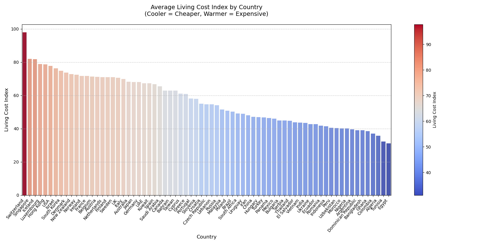

# International Education Cost Analysis / 国际教育成本分析

Comprehensive analysis of global education costs covering tuition, living expenses and cost-effectiveness insights /  
全球教育成本综合分析，涵盖学费、生活开支与成本效益洞察

## 🐱Table of Contents / 目录
- [数据清洗 Data Cleaning](#数据清洗-data-cleaning)
- [可视化 Visualizations](#可视化-visualizations)
- [见解与解释  Insights-and-Explanations](#见解与解释-Insights-and-Explanations).
- [建议 Recommendations](#建议-recommendations)
- [结论 Conclusion](#结论-conclusion)
- [hhhd](#运行指南-getting-started)

## 🚿数据清洗 Data Cleaning

#### 数据清洗流程如下：
1.	数据上传：
 使用 SCP 将本地 CSV 文件上传至 Hadoop 虚拟机的 HDFS 路径。
 在 Hive View 中创建 international_education_costs 表，指定字段格式、分隔符，并设置 TBLPROPERTIES ("skip.header.line.count"="1") 来跳过表头。
2.	字段校验与类型转换：
 将各字段定义为适当的数据类型，如 DOUBLE（学费、生活费等）、INT（时长）、STRING（国家、城市、大学等）。
 Hive 表建成后，通过查询确认数据成功加载并可以进行 SQL 操作。
3.	缺失值与异常值检查：
 使用 Hive SQL 查看是否存在 NULL 或无效值（如负数学费、生活指数为 0 等）。这次采用的数据源结构良好，未发现明显缺失或错误数据。有一个需要注意的是表格中部分北欧国家的学费为0，但是这不是缺失值，部分北欧国家的学校是免学费的。
4.	逻辑派生字段创建（在分析中完成）：
 在 Python 中读取 Hive 查询结果后，派生字段如 Total_Cost_USD（学费 + 签证费 + 保险 + 房租等）以及国家/学位维度的平均值列，为后续可视化准备数据。

#### Data cleaning process is as follows:
1. Data Upload:
 Use SCP to upload the local CSV file to the HDFS path of the Hadoop virtual machine.
 Create the international_education_costs table in Hive View, specifying the field format, delimiters, and setting TBLPROPERTIES ("skip.header.line.count"="1") to skip the header.
2. Field Validation and Type Conversion:
 Define each field as an appropriate data type, such as DOUBLE (tuition, living expenses, etc.), INT (duration), STRING (country, city, university, etc.).
 After the Hive table is built, confirm that the data is successfully loaded and SQL operations can be performed through queries.
3. Missing Value and Outlier Check:
 Use Hive SQL to check for NULL or invalid values ​​(such as negative tuition fees, living index of 0, etc.). The data source used this time has a good structure, and no obvious missing or incorrect data was found. One thing to note is that the tuition fees of some Nordic countries in the table are 0, but this is not a missing value. Some schools in Nordic countries are tuition-free.
4. Logical Derived Field Creation (completed in analysis):
 After reading the Hive query results in Python, derive fields such as Total_Cost_USD (tuition + visa fee + insurance + rent, etc.) and average value columns for country/degree dimensions to prepare data for subsequent visualization.
## 🤩可视化 visualization

## 🦁见解与解释-Insights and Explanations

## 👻建议 Recommendations

## 🥳结论 Conclusion

